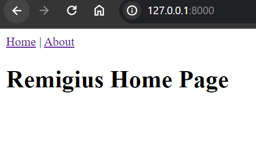
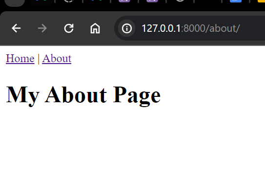
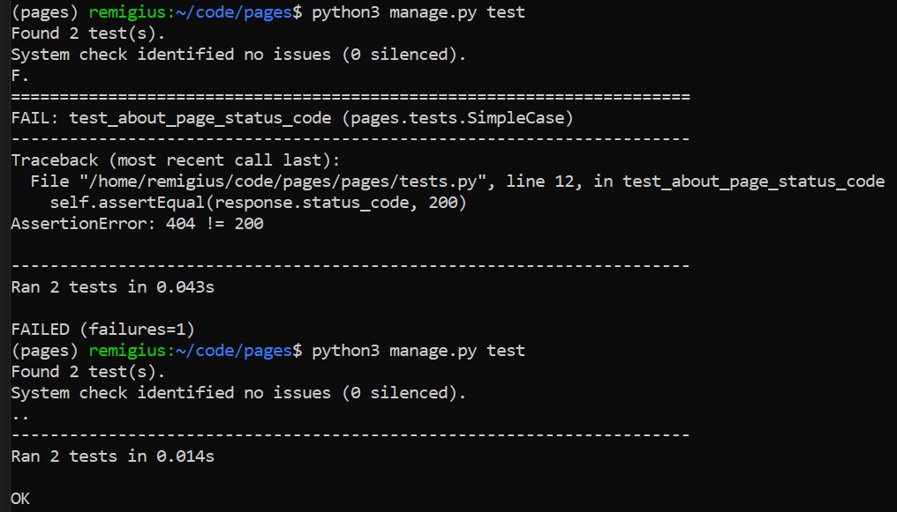

# Project Setup and Development Process Overview

## Introduction
To ensure a clean and isolated development environment, I utilized `pipenv` to create a virtual environment for the project. Within this environment, I installed Django and proceeded to set up the project and app.

## Project Configuration
1. **App Integration**: I created a Django app named `pages` within the project. To integrate this app with the main project (`pages_project`), I added it to the list of installed apps in the project settings.
   
2. **URL Configuration**: Within the `pages` app, I established a `urls.py` file to define URL patterns specific to the app's functionality. These URL patterns were then included in the main project's `urls.py` file to ensure proper routing.

3. **Templates Directory Setup**: In preparation for rendering HTML content, I created a `templates` directory within the `pages` app. This directory serves as the location for storing HTML files related to the app's views.

4. **Template Configuration**: To instruct Django on where to locate HTML templates, I registered the `templates` directory in the project settings. This ensures that Django can find and render the appropriate templates when requested.

## App Development
1. **View Functions**: Within the `views.py` file of the `pages` app, I defined view functions to handle various HTTP requests and generate appropriate responses. These view functions encapsulate the logic for rendering HTML content and processing user input.

2. **URL Routing**: Each view function was mapped to specific URL patterns within the `urls.py` file of the `pages` app. This mapping allows Django to route incoming requests to the corresponding view function based on the requested URL.

## Testing
To verify the correctness of the implemented routing and functionality, I wrote test cases in the `tests.py` file of the `pages` app. These test cases simulate various scenarios to ensure that the routing behaves as expected and that the views generate the correct responses.

## HTML Templates
1. **Base Template Creation**: I created a `base.html` file within the `templates` directory to serve as the base template for other HTML files. This base template contains common elements shared across multiple pages, such as the header and footer.

2. **Page-Specific Templates**: In addition to the base template, I developed page-specific HTML templates (`home.html` and `about.html`) within the `templates` directory. These templates define the layout and content for the home page and about page, respectively.

3. **Template Inheritance**: To avoid code duplication and promote maintainability, I utilized template inheritance by importing the `base.html` file into the `home.html` and `about.html` templates. This allows the page-specific templates to inherit common elements from the base template while overriding or extending specific sections as needed.

## Images
Home page

About Page

Test

## Conclusion
By following this structured approach to project setup and development, I was able to create a well-organized Django project with proper configuration, routing, and HTML templating. This methodology ensures clarity, maintainability, and scalability throughout the development process.

